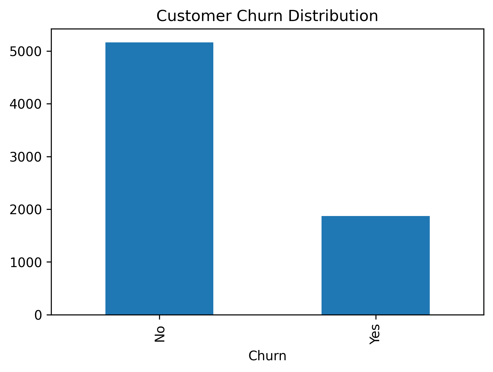
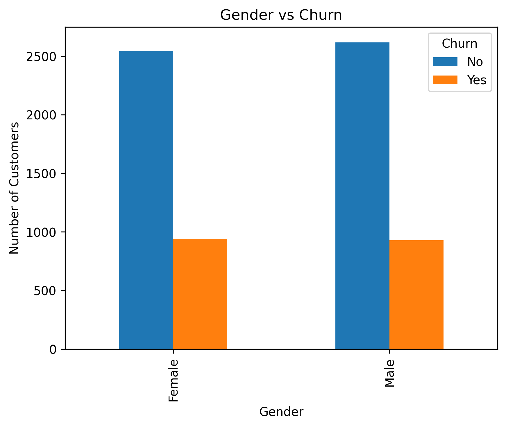
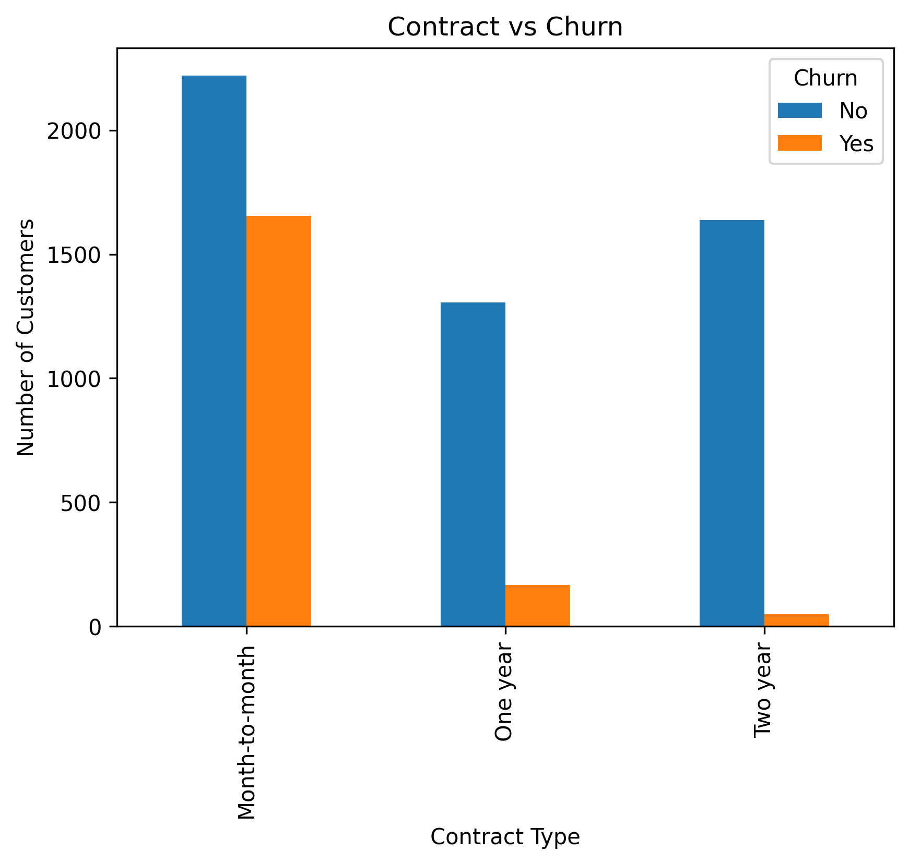
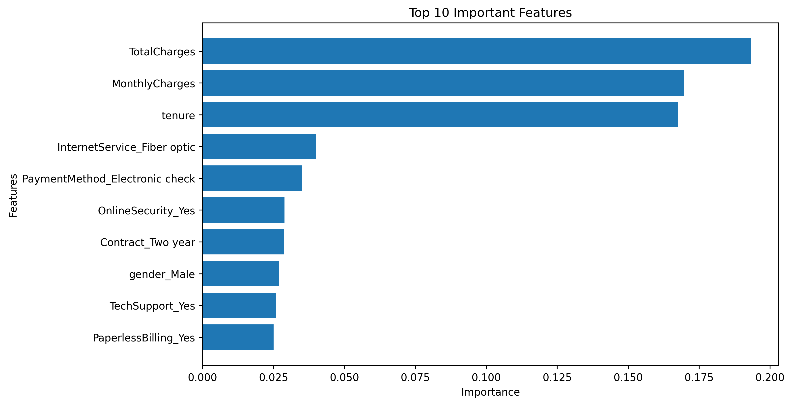

# 📊 Customer Churn Prediction

## 📌 Project Overview

This project predicts whether a customer is likely to churn using Machine Learning. It includes data cleaning, exploratory data analysis (EDA), feature engineering, model building, evaluation, and a Streamlit web application.

---

## 🛠️ Technologies Used

- Python
- Pandas
- NumPy
- Matplotlib
- Scikit-learn
- Streamlit

---

## 📊 Customer Churn Distribution

---

## 👨 Gender vs Churn

---

## 📑 Contract Type vs Churn

---

## 🌳 Top 10 Feature Importance

---

## 💻 Streamlit Web Application

---

## 🤖 Machine Learning Models

- Logistic Regression
- Decision Tree
- Random Forest

---

## 📈 Model Performance

- Accuracy: **80.31%**
- Precision
- Recall
- F1-Score

*(Accuracy: 80.31%)*

---

## 💡 Business Insights

- Customers with month-to-month contracts are more likely to churn.
- Customers with higher monthly charges have a higher churn rate.
- Long-term customers are less likely to churn.
- Customer retention strategies can reduce churn.

---

## 👨‍💻 Author

**Elavarasan T**

GitHub: https://github.com/elavarasan-ai
